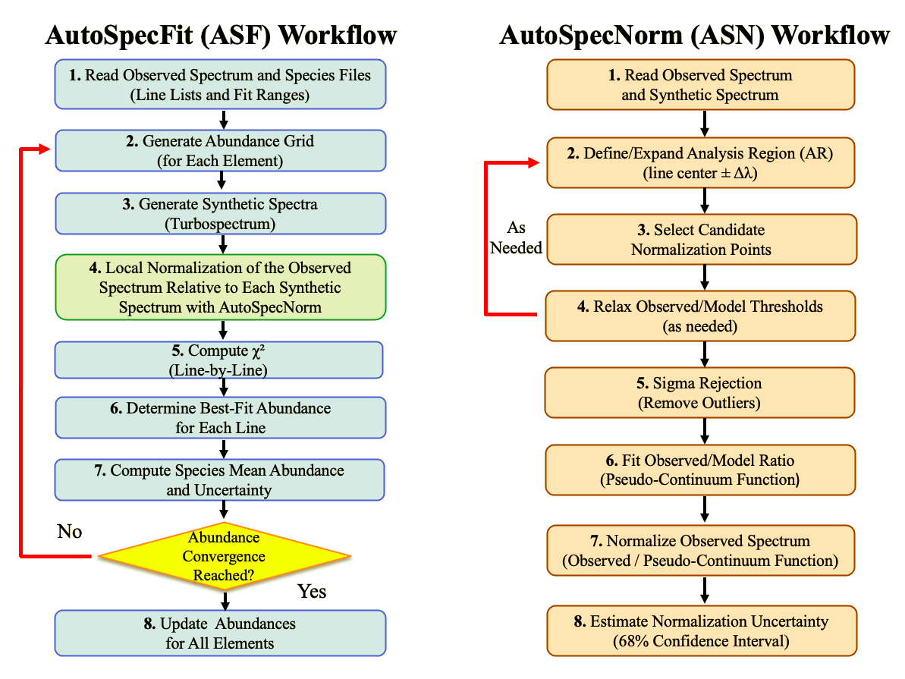

# AutoSpecFit (ASF)

**Automated Spectral Fitting Framework for Chemical Abundance Measurements of Cool Stars**

AutoSpecFit (ASF) is an automated line-by-line spectral synthesis framework designed for high-resolution chemical abundance measurements of cool stars. ASF combines synthetic spectra generated with Turbospectrum and local pseudo-continuum normalization performed by AutoSpecNorm (ASN) to determine elemental abundances through chi-square fitting of individual spectral lines.

ASF v1.0 is designed for abundance measurements assuming fixed stellar atmospheric parameters supplied by the user. A future release, ASF v2.0, will introduce iterative stellar-parameter optimization between abundance iterations, enabling self-consistent determinations of effective temperature (Teff), surface gravity (log g), and overall metallicity ([M/H]) alongside elemental abundances. This extension will allow atmospheric parameters and chemical abundances to be refined simultaneously throughout the fitting process. 

---

## Workflow



---

## Main Features

- Automated line-by-line abundance determination.
- Local pseudo-continuum normalization using AutoSpecNorm (ASN).
- Local normalization performed independently for each tested synthetic spectrum.
- Abundance-dependent pseudo-continuum placement.
- Iterative abundance refinement.
- Line-by-line chi-square analysis.
- Abundance uncertainty estimation.
- Designed for high-resolution spectra of cool stars.
- Tested primarily on IGRINS spectra with resolving power R ≈ 45,000.
- Compatible with Turbospectrum v15.1 through user-supplied external synthesis scripts.

---

## AutoSpecNorm (ASN)

ASF uses AutoSpecNorm (ASN) for local pseudo-continuum normalization. Unlike approaches that apply a single normalization to all synthetic spectra, ASF applies local normalization independently to every synthetic spectrum tested during the chi-square fitting procedure. This allows the pseudo-continuum placement to adapt to abundance-dependent changes in the synthetic spectrum and keeps the abundance determination self-consistent.

ASN consists of two main modules:

- `AutoSpecNorm_Regions.py`
- `AutoSpecNorm_Points.py`

---

## Current ASF Workflow

1. Read the observed stellar spectrum.
2. Read species-specific line-list files.
3. Generate abundance grids.
4. Launch Turbospectrum calculations externally.
5. Wait for synthetic spectra to become available.
6. Perform local pseudo-continuum normalization with ASN.
7. Compute line-by-line chi-square curves.
8. Determine best-fit abundances and uncertainties.
9. Update fixed elemental abundances between iterations.
10. Write final abundance results.

---

## Atmospheric Parameters

ASF v1.0 requires the following stellar atmospheric parameters:

- Effective temperature (`Teff`)
- Surface gravity (`log g`)
- Overall metallicity (`[M/H]`)

Optional synthesis parameters include:

- Alpha enhancement (`[alpha/Fe]`)
- Microturbulent velocity (`vmic`)
- Projected rotational velocity (`v sin i`)

Default values used in the Turbospectrum workflow are:

- `[alpha/Fe] = +0.00`
- `vmic = 1.00 km s^-1`
- `v sin i = 0.00 km s^-1`

Future ASF versions will include iterative stellar-parameter optimization.

---

## Abundance Scale and Conversion to [X/H]

Abundances reported by ASF correspond to abundance offsets relative to the abundance patern of the adopted model atmosphere. They are therefore not direct `[X/H]` abundances.

For non-alpha elements, the final abundance is computed as:

```text
[X/H] = [M/H]input + ASF(X)
```

For alpha elements (e.g., O, Mg, Si, Ca, and Ti), the alpha enhancement adopted in the model atmosphere must also be included:

```text
[X/H] = [M/H]input + [alpha/Fe]input + ASF(X)
```

where `ASF(X)` is the abundance offset measured by ASF for element `X`, `[M/H]input` is the metallicity supplied by the user and adopted in the model atmosphere, and `[alpha/Fe]input` is the alpha-element enhancement adopted in the model atmosphere.

For example, for magnesium (Mg), which is an alpha element:

```text
[M/H]input      = -0.30
[alpha/Fe]input = +0.12
ASF(Mg)         = +0.15

[Mg/H] = -0.30 + 0.12 + 0.15 = -0.03
```

The abundance notation and formulation adopted by ASF follow:

Hejazi, N., Lépine, S., Nordlander, T., Jao, W.-C., Coria, D. R., &
Lester, K. V. 2025, AJ, 170, 18

DOI: 10.3847/1538-3881/add696

---

## Installation

Clone the repository:

```bash
git clone https://github.com/YOUR_USERNAME/AutoSpecFit.git
cd AutoSpecFit
```

Install required Python packages:

```bash
pip install -r requirements.txt
```

Replace `YOUR_USERNAME` with your GitHub username after creating the repository.

---

## Repository Structure

```text
AutoSpecFit/
├── README.md
├── LICENSE
├── CITATION.cff
├── requirements.txt
├── .gitignore
├── src/
│   ├── __init__.py
│   ├── AutoSpecFit_Abund_v1_0.py
│   ├── AutoSpecNorm_Regions.py
│   └── AutoSpecNorm_Points.py
├── examples/
│   ├── Example_AutoSpecNorm_Local_Normalization.py
│   ├── IGRINS_H_K_band_Flattened_Spectrum_GJ205.txt
│   ├── Species_Fit_Ranges_GJ205.txt
│   ├── t3700_g+4.5_z+0.20_a+0.00_v1.00.mod
│   └── AutoSpecNorm_Performance_Diagnostics_GJ205.png
├── docs/
│   └── ASF_ASN_Workflows.png
└── tests/
```

---

## Example

An AutoSpecNorm example is provided in:

```text
examples/Example_AutoSpecNorm_Local_Normalization.py
```

To run the example:

```bash
cd examples
python Example_AutoSpecNorm_Local_Normalization.py
```

The example demonstrates selection of local normalization points, local pseudo-continuum normalization, normalization uncertainty estimation, and comparison between observed and synthetic spectra.

---

## Turbospectrum Compatibility

ASF v1.0 has been developed and tested using Turbospectrum v15.1. ASF does not perform spectral synthesis internally. Synthetic spectra are generated externally through user-supplied scripts, and ASF then performs normalization and abundance fitting.

Users working with different Turbospectrum versions or non-SLURM systems may need to modify the synthesis-launching and job-monitoring sections of the ASF workflow.

---

## Scientific Publications

AutoSpecFit has been developed and applied in:

Hejazi et al. (2024), ApJ, 973, 31  
DOI: 10.3847/1538-4357/ad61dc

Hejazi et al. (2025), AJ, 170, 18  
DOI: 10.3847/1538-3881/add696

Additional ASF applications are currently in preparation.

---

## Citation

If AutoSpecFit contributes to your research, please cite the publications above and the software repository.

A `CITATION.cff` file is included so GitHub can display citation information automatically.

---

## License

This project is released under the MIT License.

---

## Author

Neda Hejazi
