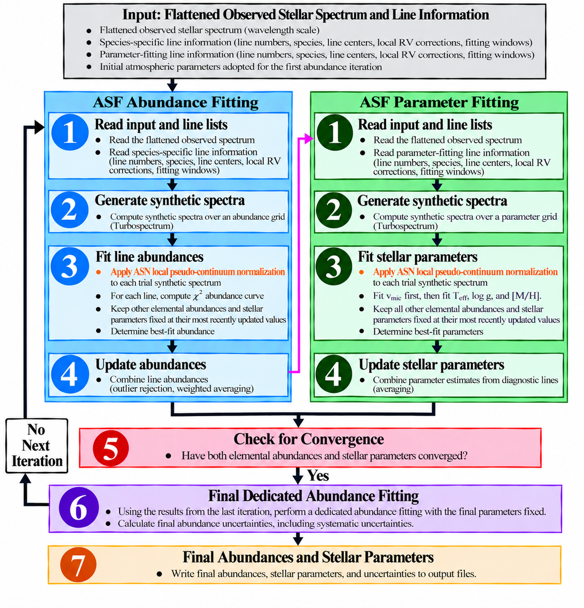

# AutoSpecFit (ASF)

**Automated Spectral Fitting Framework for Chemical Abundance Measurements of Cool Stars**

AutoSpecFit (ASF) is an automated line-by-line spectral synthesis framework designed for high-resolution chemical abundance measurements of cool stars. ASF derives elemental abundances through line-by-line chi-square minimization by comparing synthetic spectra generated with Turbospectrum to observed spectra. Prior to the comparison, the observed spectrum is locally pseudo-continuum normalized relative to each synthetic spectrum independently using the AutoSpecNorm (ASN) framework.

ASF currently includes two analysis scripts. `AutoSpecFit_Abund_v1_0.py` performs iterative elemental-abundance measurements for user-supplied, fixed stellar atmospheric parameters. `AutoSpecFit_Abund_Param_v2_0.py` extends the framework by alternating abundance determination with stellar-parameter refinement, allowing effective temperature (`Teff`), surface gravity (`log g`), overall metallicity (`[M/H]`), microturbulent velocity (`vmic`), and alpha enhancement (`[alpha/Fe]`) to be refined toward a self-consistent solution.

---

## Workflow



---

## Main Features

- Automated line-by-line elemental abundance determination.
- Local pseudo-continuum normalization of the observed spectrum using AutoSpecNorm (ASN).
- Independent local normalization of the observed spectrum with respect to each synthetic spectrum evaluated during the fitting process.
- Abundance-dependent pseudo-continuum placement for self-consistent abundance measurements.
- Iterative refinement of elemental abundances.
- Iterative stellar-parameter refinement in ASF v2.0.
- Sequential one-parameter-at-a-time fitting to reduce parameter degeneracies.
- Two-pass stellar-parameter determination: a broad Pass 1 followed by a local Pass 2 restricted to the original Pass-1 parameter grids.
- Line-by-line chi-square minimization and uncertainty estimation.
- Propagation of final atmospheric-parameter uncertainties into systematic abundance uncertainties.
- Restart/checkpoint support for long abundance and parameter-fitting runs.
- Designed for high-resolution spectra of cool stars.
- Primarily tested on IGRINS spectra with resolving power R ≈ 45,000.
- Compatible with Turbospectrum v15.1 through user-supplied external synthesis scripts.

---

## AutoSpecNorm (ASN)

AutoSpecNorm (ASN) is the local pseudo-continuum normalization module integrated into ASF. Unlike conventional approaches that compare a single normalized observed spectrum with all synthetic spectra, ASN performs an independent local normalization of the observed spectrum for every synthetic spectrum evaluated during the chi-square fitting procedure. This allows the pseudo-continuum placement to adapt to abundance-dependent spectral variations, ensuring a self-consistent abundance analysis.

ASN consists of two main modules:

- `AutoSpecNorm_Regions.py`
- `AutoSpecNorm_Points.py`

---

## Current ASF Workflow

### ASF v1.0: Abundance Fitting with Fixed Stellar Parameters

1. Read the observed stellar spectrum and species-specific line-list files.
2. Generate the elemental-abundance grids and required Turbospectrum models.
3. Perform independent local pseudo-continuum normalization with ASN for every synthetic spectrum.
4. Compute line-by-line chi-square abundance curves.
5. Determine individual-line abundances and uncertainties.
6. Combine accepted lines into species-level abundances.
7. Update the fixed elemental abundances and repeat the abundance fitting until convergence.
8. Write the final elemental abundances and uncertainties.

### ASF v2.0: Abundance + Stellar-Parameter Fitting

`AutoSpecFit_Abund_Param_v2_0.py` retains the abundance-fitting workflow above and adds stellar-parameter refinement between abundance iterations.

For the current cool-dwarf implementation, parameter refinement is performed sequentially, with only one parameter varied at a time. `vmic` is fitted first and `[alpha/Fe]` is fitted last. The ordering of the three atmospheric parameters `[M/H]`, `log g`, and `Teff` is not fixed; instead, it is determined for each target according to the availability, strength, and distinctiveness of their parameter-specific diagnostic lines.

In general, parameters with stronger and more distinct diagnostic lines are fitted earlier in the sequence, allowing the better-constrained parameters to be established before parameters with less distinctive or more degenerate spectral responses. If suitable diagnostic lines cannot be identified for one of these parameters, that parameter is placed last among `[M/H]`, `log g`, and `Teff` and is fitted using the full set of selected spectral lines rather than a parameter-specific diagnostic subset.

The general fitting sequence is therefore:

```text
vmic -> [M/H], log g, Teff (target-dependent order) -> [alpha/Fe]
```

The parameter determination uses two passes:

- **Pass 1:** searches the original/global parameter grids. Parameter-specific diagnostic lines are used when suitable diagnostics have been identified. The ordering of `[M/H]`, `log g`, and `Teff` follows the relative strength and distinctiveness of their diagnostic lines for the target being analyzed. If no suitable diagnostic subset is available for a parameter, that parameter is placed last among these three parameters and fitted using the full set of selected spectral lines. `vmic` is fitted first using the full parameter line list, while `[alpha/Fe]` is fitted last using selected alpha-element lines.
- **Pass 2:** repeats the adopted parameter sequence using local five-point grids centered on the Pass-1 solutions. Every Pass-2 trial value is an existing point from the corresponding Pass-1/original grid; Pass 2 never extends beyond the original parameter grid. The local window shifts inward when the Pass-1 solution lies near a grid boundary.

Atmospheric-parameter and abundance iterations alternate until the adopted convergence conditions are satisfied. Once the final stellar parameters are accepted, ASF performs a dedicated final abundance determination, converts the native ASF abundance offsets to the final `[X/H]` scale using the adopted `[M/H]` and `[alpha/Fe]`, and propagates the atmospheric-parameter uncertainties into the elemental-abundance error budget.

---

## Atmospheric Parameters

### ASF v1.0

`AutoSpecFit_Abund_v1_0.py` treats the stellar atmospheric parameters as fixed user-supplied inputs:

- Effective temperature (`Teff`)
- Surface gravity (`log g`)
- Overall metallicity (`[M/H]`)

Additional synthesis parameters include alpha enhancement (`[alpha/Fe]`), microturbulent velocity (`vmic`), and projected rotational velocity (`v sin i`), as required by the adopted Turbospectrum workflow.

### ASF v2.0

`AutoSpecFit_Abund_Param_v2_0.py` can iteratively refine:

- Effective temperature (`Teff`)
- Surface gravity (`log g`)
- Overall metallicity (`[M/H]`)
- Alpha enhancement (`[alpha/Fe]`)
- Microturbulent velocity (`vmic`)

The parameter grids, diagnostic-line selections, convergence tolerances, fitting order, and Turbospectrum execution settings are defined in the configuration section of the script and should be adapted to the target star and analysis setup. The parameter-fitting strategy is therefore configurable rather than a universal set of hard-coded stellar values.

---

## Abundance Scale and Conversion to [X/H] in ASF v2.0

In `AutoSpecFit_Abund_Param_v2_0.py`, ASF determines an **abundance offset**, `ASF(X)`, for each fitted element. This quantity represents the elemental abundance change relative to the abundance pattern of the model atmosphere used for the spectral synthesis. The native ASF abundance offset is therefore not, by itself, the standard `[X/H]` abundance.

Because ASF v2.0 iteratively refines `[M/H]` and `[alpha/Fe]` together with the other stellar parameters, the conversion of the final abundance offsets to `[X/H]` uses the **final adopted fitted atmospheric parameters**, not the initial values supplied at the beginning of the run.

For a non-alpha element, the final abundance is:

```text
[X/H] = [M/H]final + ASF(X)
```

For an alpha element, the final abundance is:

```text
[X/H] = [M/H]final + [alpha/Fe]final + ASF(X)
```

where `ASF(X)` is the abundance offset measured by ASF for element `X`, `[M/H]final` is the final adopted metallicity from the ASF v2.0 parameter solution, and `[alpha/Fe]final` is the final adopted alpha-element enhancement. The alpha-element set used in the calculation is defined by `alpha_species` in the configuration section of the script. In the current default configuration, these species are O/OH, Mg, Ca, and Ti.

The final ASF v2.0 abundance table retains the native `ASF_Offset` for traceability and also reports the converted `Final_X_H` abundance.

For example, for magnesium (Mg), which is an alpha element:

```text
[M/H]final      = -0.30
[alpha/Fe]final = +0.12
ASF(Mg)         = +0.15

[Mg/H] = -0.30 + 0.12 + 0.15 = -0.03
```

The abundance uncertainties reported by ASF v2.0 are associated with the final `[X/H]` abundance. The random uncertainty from the dedicated final abundance fit is unchanged by adding the nominal final atmospheric-composition terms. Systematic abundance uncertainties are evaluated by perturbing the final stellar parameters one at a time, converting both the nominal and perturbed abundance offsets to their corresponding `[X/H]` values, and measuring the resulting abundance shifts. The systematic contributions are combined in quadrature, and the final total abundance uncertainty is:

```text
Final_Total_Error = sqrt(Final_Random_Error^2 + Final_Systematic_Error^2)
```

The abundance notation and formulation adopted by ASF follow:

Hejazi, N., Lépine, S., Nordlander, T., Jao, W.-C., Coria, D. R., &  
Lester, K. V. 2025, AJ, 170, 18

DOI: 10.3847/1538-3881/add696

---

## Installation

Clone the repository:

```bash
git clone https://github.com/nedahejazi/AutoSpecFit.git
cd AutoSpecFit
```

Install required Python packages:

```bash
pip install -r requirements.txt
```
---

## Repository Structure

```text
AutoSpecFit/
├── README.md
├── LICENSE
├── CITATION.cff
├── requirements.txt
├── .gitignore
├── src/
│   ├── __init__.py
│   ├── AutoSpecFit_Abund_v1_0.py
│   ├── AutoSpecFit_Abund_Param_v2_0.py
│   ├── AutoSpecNorm_Regions.py
│   └── AutoSpecNorm_Points.py
├── examples/
│   ├── Example_AutoSpecNorm_Local_Normalization.py
│   ├── IGRINS_H_K_band_Flattened_Spectrum_GJ205.txt
│   ├── Species_Fit_Ranges_GJ205.txt
│   ├── t3700_g+4.5_z+0.20_a+0.00_v1.00.mod
│   └── AutoSpecNorm_Performance_Diagnostics_GJ205.png
├── docs/
│   └── ASF_ASN_Workflows.png
└── tests/
```

---

## Example

An AutoSpecNorm example is provided in:

```text
examples/Example_AutoSpecNorm_Local_Normalization.py
```

To run the example:

```bash
cd examples
python Example_AutoSpecNorm_Local_Normalization.py
```

The example demonstrates selection of local normalization points, local pseudo-continuum normalization, normalization uncertainty estimation, and comparison between observed and synthetic spectra.

---

## Turbospectrum Compatibility

ASF has primarily been developed and tested using Turbospectrum v15.1. ASF does not perform spectral synthesis internally. Instead, it prepares the required model grids, calls user-supplied external Turbospectrum scripts, waits for the expected synthetic spectra, and then performs normalization and spectral fitting.

ASF v2.0 requires synthetic spectra spanning both the abundance grids and the adopted stellar-parameter grids. Users working with different Turbospectrum versions, atmosphere grids, execution scripts, or non-SLURM systems may need to modify the synthesis-launching, model-naming, and job-monitoring sections of the workflow.

---

## Scientific Publications

AutoSpecFit has been developed and applied in:

Hejazi et al. (2024), ApJ, 973, 31  
DOI: 10.3847/1538-4357/ad61dc

Hejazi et al. (2025), AJ, 170, 18  
DOI: 10.3847/1538-3881/add696

Additional ASF applications are currently in preparation.

---

## Citation

If AutoSpecFit contributes to your research, please cite the publications above and the software repository.

A `CITATION.cff` file is included so GitHub can display citation information automatically.

---

## License

This project is released under the MIT License.

---

## Author

Neda Hejazi
